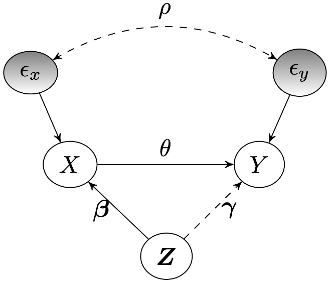

# leakyIV: Bounding Causal Effects with Leaky Instruments
<p align="center">

</p>

Instrumental variables (IVs) are a popular and powerful tool for estimating causal effects in the presence of unobserved confounding. However, classical methods rely on strong, untestable assumptions such as the *exclusion criterion*, which states that instrumental effects must be entirely mediated by treatments. In the so-called "leaky" IV setting, candidate instruments are allowed to have some direct influence on outcomes, rendering the average treatment effect (ATE) unidentifiable. But with limits on the amount of information leakage, we may still recover a partial identification interval for the ATE. This package implements methods for ATE bounding in the leaky IV setting with linear structural equations.

We assume data are generated according to the following process: $$X := Z \beta + \epsilon_X$$ $$Y := Z \gamma + X \theta + \epsilon_Y,$$ where the correlation between additive noise terms $\epsilon_X, \epsilon_Y$ is given by unobserved parameter $\rho$. The ATE is denoted by $\theta$. Whereas classical IV models require each $\gamma$ coefficient to be zero, we permit some direct signal from $Z$ to $Y$. Specifically, `leakyIV` can compute an exact ATE interval when bounding $\lVert \gamma \rVert_p$ or an approximate interval when placing separate bounds on each $\gamma$ coefficient. Several algorithms for covariance matrix estimation are implemented, as well as a bootstrapping procedure for uncertainty quantification.

To install the package directly from GitHub, run the following in R:
``` r
devtools::install_github('dswatson/leakyIV')
```